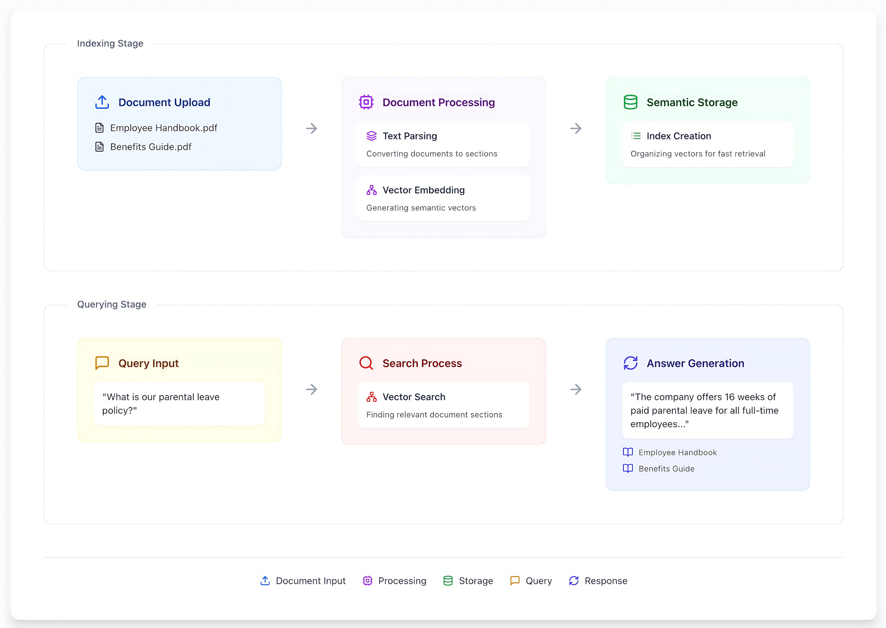

# Enterprise Search

Enterprise Search is a  Retrieval-Augmented Generation (RAG) system designed for efficient local information retrieval on document collections. It uses vector search techniques with language models to provide context-aware answers to your queries.

Enterprise Search is designed to be dynamic and adaptable to fit in both development and production workflows. It offers a RestFul API for indexing and querying over document collections, making it ideal for businesses and developers seeking to deploy the question-answering solutions in their infrastructure.

<div align="center">
  <picture>
    <source media="(prefers-color-scheme: dark)" srcset="assets/cover_image.png#gh-dark-mode-only"/>
    <source media="(prefers-color-scheme: light)" srcset="assets/cover_image.png#gh-light-mode-only"/>
    
  </picture>

  <p align="center">
    <em> High level overview of user interaction with the Enterprise Search system </em>
  </p>
</div>

## 📚 Table of Contents

- [Key Features](#-key-features)
- [Prerequisites](#%EF%B8%8F-prerequisites)
- [Quick Start](#-quick-start)
- [Configuration](#%EF%B8%8F-configuration)
- [API](#-api)
- [Testing](#-testing)
- [Evaluation](#-evaluation)
- [Deployment](#-deployment)
- [UI](#%EF%B8%8F-ui)
- [License](#-license)
- [Acknowledgements](#-acknowledgements)

## 🚀 Key Features

<div align="center">
  <picture>
    <source media="(prefers-color-scheme: dark)" srcset="./assets/key-features-0.1.svg#gh-dark-mode-only"/>
    <source media="(prefers-color-scheme: light)" srcset="./assets/key-features-0.1.svg#gh-light-mode-only"/>
    
  </picture>

  <p align="center">
    <em>Enterprise Search - Key Features</em>
  </p>
</div>

## 🛠️ Prerequisites

Before setting up Enterprise Search, ensure you have:

- Python 3.9 or higher
- Docker and Docker Compose
- CUDA 11 or higher (for GPU acceleration)

*Note: Depending on your Docker Compose version, you may need to use docker-compose (with a hyphen) instead of docker compose.*

## ⚙️ Configuration

1. Rename `.env.example` to `.env` and update the values to match your setup.

2. Update the configuration in `config/config.dev.yaml`. Default settings are defined in `llamasearch/settings.py`:
- `application`: Application settings
- `vector_store_config`: Qdrant settings for vector storage
- `qdrant_client_config`: Qdrant client connection settings
- `redis_config`: Redis settings for document store and cache
- `embedding`: Embedding model configuration (uses model from HuggingFace)
- `llm`: Language model configuration (uses model from ollama/openai)
- `reranker`: Reranker model settings (uses model from HuggingFace)

3. Setup LLM of your choice.

### Open-Source Option: Ollama

1. **Run Ollama docker:**: Use the `docker/docker-compose-ollama.yml` file to run Ollama:
```bash
docker-compose -f docker/docker-compose-ollama.yml up -d
```
The docker container will pull models mentioned in the `config/config.dev.yaml` on startup. It may take few minutes to download the models. Check ollama docker logs for progress.

### External Providers Option: OpenAI

To use OpenAI's proprietary models, set `OPENAI_API_KEY` in .env file.

1. **Set up OpenAI API key**: Export your OpenAI API key:
```bash
export OPENAI_API_KEY=your_api_key_here
```
2. **Configure for OpenAI:**: Update the `config/config.dev.yaml` file to use an OpenAI model, set `use_openai` flag to `True`. Check the [openai models list](https://platform.openai.com/docs/models).

## 🚀 Quick Start

### Option 1: Jupyter Notebook

1. Clone the repository and set up the environment:
```bash
conda create --name es_env python=3.9
conda activate es_env
pip install -r requirements.txt
```

2. Start Jupyter Notebook:
```bash
pip install jupyter
jupyter notebook
```

3. Open the `quick_start.ipynb` file in your browser and follow the step-by-step instructions to set up and test the pipeline.

### Option 2: Command Line Interface

1. Set up the environment (same as above)

2. Configure the application:
- Modify `config/config.dev.yaml` to match your setup.

4. Start the redis and qdrant services:
```bash
docker-compose -f docker/docker-compose.yml up -d redis qdrant
```

5. Run the pipeline::
```bash
python -m llamasearch.pipeline
```

The pipeline loads documents from `application->data_path` defined in config file, processes and indexes them on startup. Enter your query when prompted. Results will be displayed in the terminal.

## 🌐 API

We provide a RESTful API for document indexing, querying, and management. Follow steps to test the pipeline and backend server (API) using curl locally.

Default API settings are defined in `llamasearch/api/core/config.py`. These settings can be customized using environment variables defined in `.env` file in the project root.

*Important: When deploying to production, ensure you set appropriate values related to server, authentication.*

1. **Build the Docker Image:**
Run the following command to build the Docker image.
```bash
docker build -t es:latest -f docker/Dockerfile .
```

2. **Authentication**:  Update `FIREBASE_CREDENTIALS_PATH` to point to your firebase credentials file in `.env` file for user authentication. Refer to [Firebase README](docs/firebase.md) for instructions.

*Note: Currently, we only support testing API endpoints with authentication enabled. A firebase account is required to test the API endpoints.*

3. **Setup LLM**: Setup the LLM of your choice (if you haven't already) as mentioned in the [configuration](#configuration) section. Ensure the LLM service is running.

4. **Run the docker image:**
Adjust docker mount points in the `docker/docker-compose.yml` file to point to match your local setup. It will run the API server on port 8010 by default.
```bash
docker-compose -f docker/docker-compose.yml up -d
```

5. **Test API**: For API usage examples, including request and response formats, curl request examples and more, please refer to our [API Documentation](docs/api.md).

## 🧪 Testing

We use pytest for testing. To run the test suite:

1. Ensure you're in the project root directory.

2. Start the API server as stated in the [API](#api) section.

3. In another terminal, set up the Python path:
```bash
export PYTHONPATH=$PYTHONPATH:$(pwd)
```

4. Run the tests:
```bash
pytest
```

For more detailed testing instructions, including how to run specific tests, please refer to our [Testing Guide](docs/testing.md).

## 📊 Evaluation

Enterprise Search includes a robust evaluation module based on DeepEval to assess the RAG pipeline's performance:

- 🧪 Synthetic dataset generation for simulating  your documents
- 📈 Industry standard metrics including faithfulness, relevancy, and coherence

For step-by-step instructions on running evaluations, see our [Evaluation Guide](docs/eval.md).

## 🚀 Deployment

Enterprise Search can be deployed using Kubernetes and Helm. Here's a high-level overview of the deployment process:

1. Build and push the Docker image to your docker registry:
```bash
docker build -t es:latest .
docker push es:latest
```

2. Configure your Kubernetes cluster and ensure `kubectl` is set up correctly.

3. Update the `k8s/values.yaml` file with your configuration settings (namespace, service names, etc.).

4. Deploy using Helm:
```bash
cd k8s/
helm install enterprise-search . --values values.yaml
```

5. Monitor the deployment:
```bash
kubectl get pods,svc -n {{YOUR_NAMESPACE}}
```

For detailed deployment instructions, please refer to our [Deployment Guide](k8s/README.md).

## 🖥️ UI

We provide an experimental frontend application built with Next.js 14 (app router) to interact with the Enterprise Search API.

For detailed setup instructions and usage guidelines, refer to the [README](frontend/README.md).

## 📄 License

This project is licensed under the *SOFTWARE LICENCE AGREEMENT* - see the [LICENSE](LICENSE) file for details.

## 🙏 Acknowledgements

Enterprise Search project is built on top of valuable open source projects. We'd like to acknowledge the following projects and their contributors:

- [LlamaIndex](https://github.com/jerryjliu/llama_index) for a stable foundation for RAG capabilities with wide array of integrations
- [Deepeval](https://github.com/confident-ai/deepeval) for the RAG evaluation framework
- [Qdrant](https://github.com/qdrant/qdrant) for the vector database functionality
- [FastAPI](https://github.com/tiangolo/fastapi) for the high-performance web framework
- [Ollama](https://github.com/ollama/ollama) for local LLM inference
- [Redis](https://github.com/redis/redis) for caching and document storage
- [Docker](https://github.com/docker) for containerization
- [Kubernetes](https://github.com/kubernetes/kubernetes) for orchestration

