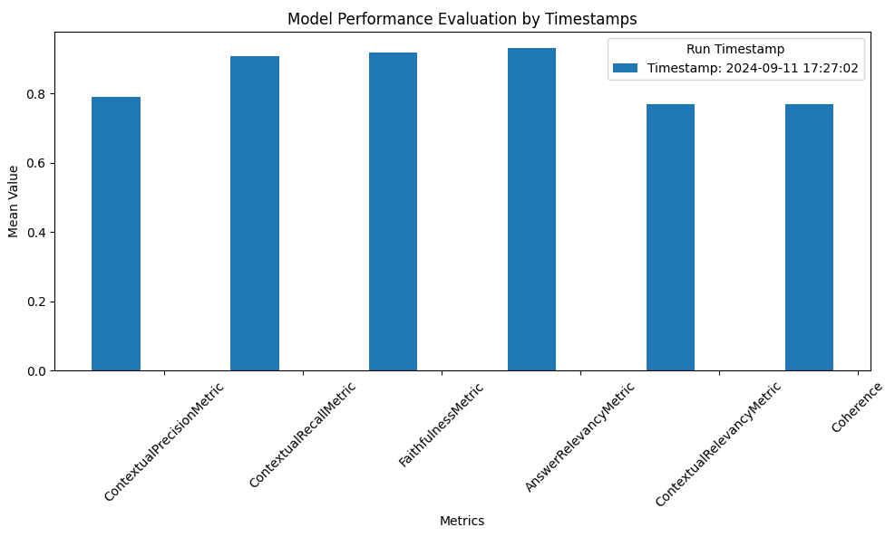

## Evaluation

The Evaluation module assesses the performance of the RAG Pipeline using the [DeepEval framework](https://github.com/confident-ai/deepeval).

It leverages a set of metrics to provide a comprehensive evaluation of the system's output compared to ground truth data.

### Prerequisites

Setup the conda environment, start the redis, qdrant and ollama services as mentioned in the [README](../README.md).


### Preparing the Dataset

Generate a Synthetic Dataset on your documents
To evaluate the pipeline, a synthetic dataset for your document nodes(chunks) shall be generated. This dataset will consist of question-answer pairs derived from the nodes. 
*Note: Ensure the chunking method remains same for the synthetic dataset generation and evaluation for a fair comparison.*


#### Option 1: Using OpenAI

Set the OpenAI API key in your environment variables:
```bash
export OPENAI_API_KEY='your_openai_api_key_here'
```

#### Option 2: Using Open Source Models

Choose the model from ollama library and update the model name. Update `llm->llm_model`  in [config](../config/config.dev.yaml). Restart the ollama docker service. This will pull the model automatically on startup in the ollama service.

Set the `dataset_generator` configuration in [config](../config/config.dev.yaml):
  - `model`: Specify the model to use (e.g., "gpt-4o" for OpenAI or a model from ollama library for local models)
  - `use_openai`: Set to True for OpenAI models, False for local models

Run the evaluation data generation script:

```bash
python -m  llamasearch.eval_data_generation --data_path ./data/eval/document/ --qa_json_path ./data/eval --save --node_limit 1
```
- `--data_path`: Add your documents in this directory for indexing.
- `--qa_json_path`: Output folder path to generate the evaluation data json.
- `--save`: A flag to instruct the script to save the evaluation results to a file.

The evaluation json file should have four keys. Refer expected output sample below.
  - `queries`
  - `response`(ground truth)
  - `relevant_docs` (query_id, nodeid k,v pairs)
  - `corpus` (node of origin for the query).

Sample evaluation json
```json
{
    "queries": {
        "2648912d-84b4-4d8f-99fa-9a520332badc": "What are the key goals outlined in the City of Adelaide's Strategic Plan for 2024-2028?"
    },
    "responses": {
        "2648912d-84b4-4d8f-99fa-9a520332badc": "The key goals outlined in the City of Adelaide's Strategic Plan for 2024-2028 are to foster boldness, aspiration, and innovation within the city."
    },
    "corpus": {
        "node_0": "Our Adelaide.\nBold.\nAspirational.\nInnovative.City of Adelaide\nStrategic Plan  \n2024  –2028"
    },
    "relevant_docs": {
        "2648912d-84b4-4d8f-99fa-9a520332badc": [
            "node_0"
        ]
    }
}
```

### Evaluation Metrics Configuration

Before running the evaluation, set up the metrics configuration file `config/eval.yaml`. This file defines the thresholds and models for each metric:

- **Metrics**: Each metric (e.g., answer_relevancy, faithfulness) has a configuration block.
- **Threshold**: Defines the minimum acceptable score for each metric (e.g., 0.7).
- **Model Type**: `openai`: Uses OpenAI's API for evaluation (reliable for LLM as a judge setup).
- **Model**: Specifies the evaluation model (e.g., gpt-4o for OpenAI).

Adjust these settings based on your evaluation requirements and available resources.

### Before you run the Evaluation

To perform evaluations using the `api` model type, you must set the `OPENAI_API_KEY` environment variable with your API key from OpenAI account [settings](https://platform.openai.com/api-keys).
```bash
export OPENAI_API_KEY='your_openai_api_key_here'
```

Ensure this variable is set in your environment to avoid authentication issues during the evaluation process.


To run the evaluation:

```bash
python -m llamasearch.eval --data_path ./data/eval/document/ --qa_json_path data/eval/qa_pairs/qna_dataset_xxxx_yyyy.json --output_file_name --limit 1 --save
```
This should execute the pipeline in three stages, as follows:

Arguments:
- --data_path: Directory path containing documents for evaluation. Note the documents should be the same as the one used for synthetic data generation.
- --qa_json_path: Path to the JSON file with question-answer pairs.
- --output_file_name: Flag to use a standard output filename.
- --limit: Number of questions to evaluate (default is 1).
- --save: Flag to save the evaluation results.

The evaluation generates a CSV file (./data/eval_results/eval_metrics.csv) with mean, median, and standard deviation for each metric.

### Analyzing Results

After running the evaluation, analyze the results using:

```bash
python -m llamasearch.eval_result_analyser --json_file ./data/eval_results/evaluation_result_metrics.json --model_used gpt-4o --side_note "Initial evaluation" --output_file ./data/eval_results/eval_metrics.csv
```

Arguments:
- --json_file: Path to the JSON file containing evaluation results.
- --model_used: Name of the model used for evaluation.
- --side_note: Additional note for the evaluation run.
- --output_file: Path to save the CSV file with analyzed metrics.

### Interpreting the Results

The results include metric scores for each query in a JSON file, providing insights into the quality of the answers. These metrics measure the component-wise and end-to-end accuracy of the RAG pipeline.

#### Metrics Explained:

- **faithfulness**: Measures the factual accuracy of the generated answer.
- **answer_relevancy**: Measures the relevance of the generated answer to the question.
- **contextual_precision**: Measures the signal-to-noise ratio of retrieved context.
- **contextual_recall**: Measures the ability to retrieve all relevant information required to answer the question.
- **contextual_relevancy**: Measures the relevancy of the retrieved context based on both the question and contexts.
- **coherence**: Checks alignment of the answer with the question using a custom LLM metric.

| Metric                    |     Mean |   Median |   Standard Deviation | Run Timestamp       | Model Used   | Side Note          |
|:--------------------------|---------:|---------:|---------------------:|:--------------------|:-------------|:-------------------|
| ContextualPrecisionMetric  | 0.790433 | 1        |             0.322457 | 2024-09-11 17:27:02 | gpt-4o       | Initial evaluation  |
| ContextualRecallMetric     | 0.907876 | 1        |             0.253418 | 2024-09-11 17:27:02 | gpt-4o       | Initial evaluation  |
| FaithfulnessMetric         | 0.918978 | 1        |             0.238641 | 2024-09-11 17:27:02 | gpt-4o       | Initial evaluation  |
| AnswerRelevancyMetric      | 0.930791 | 1        |             0.203652 | 2024-09-11 17:27:02 | gpt-4o       | Initial evaluation  |
| ContextualRelevancyMetric  | 0.770308 | 1        |             0.373611 | 2024-09-11 17:27:02 | gpt-4o       | Initial evaluation  |
| Coherence                  | 0.768505 | 0.874086 |             0.258601 | 2024-09-11 17:27:02 | gpt-4o       | Initial evaluation  |

 