# Deployment Guide

## Introduction

This guide will lead you through the process of deploying our the Enterprise Search solution, powered by Ollama, Qdrant, and Redis services on a Kubernetes cluster.

<div align="center" style="background-color: white; padding: 20px; border-radius: 8px;">
  
</div>
<p align="center" style="color: white;"><em>Figure 1: Enterprise Search Kubernetes Deployment Flow</em></p>

## 🚀 Quick Start

1. Build Docker image: `docker build -t es:latest -f docker/Dockerfile .`
2. Test locally: `docker-compose up -f docker/docker-compose.yml up`
3. Push to registry: `docker push es:latest`
4. Update the `values.yaml` file with your configuration settings.
5. Deploy to Kubernetes: `helm install enterprise-search . --values values.yaml`

## 📋 Prerequisites

- [Docker](https://www.docker.com/get-started)
- [Helm 3](https://helm.sh/docs/intro/install/)
- [kubectl](https://kubernetes.io/docs/tasks/tools/)
- Firebase credentials (for authentication)

## 🔒 Firebase Setup (Required)

Currently, we support API testing only with authentication enabled. To set up Firebase authentication, follow these steps:

1. Obtain Firebase credentials:
   - Go to the Firebase Console (https://console.firebase.google.com/)
   - Create a new project or select an existing one
   - Navigate to Project Settings > Service Accounts
   - Click "Generate New Private Key" to download the credentials JSON file

2. Place the Firebase credentials file:
   - Rename the downloaded file to `firebase.json`
   - Create a `keys` directory in the project root
   - Move `firebase.json` into the `keys` directory

3. Create a Kubernetes secret (for deployment):
```bash
kubectl create secret generic firebase-credentials --from-file=firebase.json=./keys/firebase.json
```

4. Update your .env file with the Firebase configuration:
```bash
FIREBASE_CREDENTIALS_PATH=/app/keys/firebase.json
FIREBASE_API_KEY=your_firebase_api_key
FIREBASE_TEST_UID=your_firebase_test_uid
```

These steps ensure that Firebase credentials are properly set up for both local development and Kubernetes deployment.

## 🛠 Deployment Steps

### 1. Docker Build

First, build the Docker image for the ES pipeline.

```bash
docker build -t es:latest -f docker/Dockerfile .
```

### 2. Docker Test

Test the Docker image. Typically you might want to check to ensure there are no startup errors.

```bash
docker-compose up -f docker/docker-compose.yml up
```

Check root [README.md](../README.md) for more information on how to build and test the docker.

### 3. Docker Push (Optional: If testing in local k8s cluster)

Push the built images to your preferred Docker registry:

```bash
docker push es:latest
```

### 4. Create Persistent Volume Claim (PVC)

Deploy the PVC to persistent storage to store data and models:

```bash
kubectl apply -f k8s/pvc.yaml
```

### 5. Create Config Map

Update the configuration in `k8s/config-map.yaml` and deploy the ConfigMap to provide configuration for enterprise search RAG pipeline.:

```bash
kubectl apply -f k8s/config-map.yaml
```

### 6. Helm Values File

Refer table for detailed description of configuration settings used for each service (`es (app)`,`ollama`, `qdrant`, `redis`). 

<details>
<summary>Click to expand configuration table</summary>

| Key | Type | Default | Description |
| --- | ---- | ------- | ----------- |
| **App Settings** | | | |
| app.name | String | "enterprise-search" | The name of the application. |
| app.namespace | String | aiml-engineering | The Kubernetes namespace for the application. |
| app.enabled | Boolean | true | Whether the application is enabled. |
| app.image.repository | String | docker.aiml.team/products/aiml/enterprise-search/llamasearch | The Docker image repository. |
| app.image.tag | String | latest | The Docker image tag. |
| app.image.pullPolicy | String | Always | The image pull policy. |
| app.service.type | String | ClusterIP | The type of Kubernetes service. |
| app.service.port | Integer | 8010 | The port on which the service is exposed. |
| app.service.targetPort | Integer | 8010 | The target port on the container. |
| app.resources.limits.nvidia.com/gpu | String | "1" | The GPU limit for the app. |
| app.resources.limits.cpu | String | "10000m" | The CPU limit for the app. |
| app.resources.limits.memory | String | "10Gi" | The memory limit for the app. |
| **App Environment Variables** | | | |
| app.env.APP_BASE_PATH | String | /app | The base path for the application. |
| app.env.CONFIG_PATH | String | "/app/config.yaml" | The path to the configuration file. |
| app.env.DATA_PATH | String | "/data/files" | The path to the data files. |
| app.env.LOG_DIR | String | "/data/app/logs" | The directory for log files. |
| app.env.OLLAMA_SERVER_URL | String | "http://ollama-es-service.aiml-engineering.svc.cluster.local:80" | The URL for the Ollama server. |
| app.env.OPENAI_API_KEY | String | "" | The OpenAI API key (if using OpenAI models). |
| app.env.DOCKER_ENV | Boolean | true | Whether the app is running in a Docker environment. |
| app.env.API_V1_STR | String | "/api/v1" | The API version string. |
| app.env.SERVER_NAME | String | "EnterpriseSearch" | The name of the server. |
| app.env.SERVER_HOST | String | "http://localhost:8010" | The host URL for the server. |
| app.env.PROJECT_NAME | String | "EnterpriseSearch" | The name of the project. |
| app.env.ENABLE_RATE_LIMIT | Boolean | false | Whether rate limiting is enabled. |
| app.env.BACKEND_CORS_ORIGINS | String | "http://localhost:3000,http://localhost:3001" | Allowed CORS origins. |
| app.env.DATABASE_URL | String | "sqlite+aiosqlite:///./test.db" | The database URL. |
| app.env.REDIS_URL | String | "redis://redis-service:6379/0" | The Redis URL. |
| app.env.ENABLE_AUTH | Boolean | true | Whether authentication is enabled. |
| app.env.COOKIE_SECURE | Boolean | false | Whether secure cookies are used. |
| app.env.LOGLEVEL | String | "DEBUG" | The logging level. |
| app.env.FIREBASE_CREDENTIALS_PATH | String | "/app/keys/firebase.json" | The path to Firebase credentials. |
| **App Volumes** | | | |
| app.volumes.config.configMapName | String | "es-cmap" | The name of the ConfigMap for configuration. |
| app.volumes.data.pvcName | String | "es-pvc" | The name of the PVC for data storage. |
| app.volumes.firebase.secretName | String | "firebase-credentials" | The name of the secret for Firebase credentials. |
| app.gpuProduct | String | "NVIDIA-RTX-6000-Ada-Generation" | The GPU product to use. |
| **Ollama Settings** | | | |
| ollama.name | String | ollama-es | The name of the Ollama service. |
| ollama.enabled | Boolean | true | Whether Ollama is enabled. |
| ollama.namespace | String | aiml-engineering | The namespace for Ollama. |
| ollama.image.repository | String | ollama/ollama | The Ollama image repository. |
| ollama.image.tag | String | 0.3.6 | The Ollama image tag. |
| ollama.image.pullPolicy | String | Always | The Ollama image pull policy. |
| ollama.service.type | String | ClusterIP | The type of Ollama service. |
| ollama.service.port | Integer | 80 | The port for the Ollama service. |
| ollama.service.targetPort | Integer | 11434 | The target port for the Ollama service. |
| ollama.portName | String | http | The name of the Ollama port. |
| ollama.resources.limits.nvidia.com/gpu | String | "1" | The GPU limit for Ollama. |
| ollama.resources.limits.cpu | String | "10000m" | The CPU limit for Ollama. |
| ollama.resources.limits.memory | String | "40Gi" | The memory limit for Ollama. |
| ollama.env.OLLAMA_HOST | String | "0.0.0.0" | The host for Ollama. |
| ollama.volumes.data.pvcName | String | "es-pvc" | The name of the PVC for Ollama data. |
| ollama.gpu.enabled | Boolean | true | Whether GPU is enabled for Ollama. |
| ollama.gpu.type | String | 'nvidia' | The type of GPU for Ollama. |
| ollama.gpu.number | Integer | 1 | The number of GPUs for Ollama. |
| ollama.models | List | [ajindal/llama3.1-storm:8b] | The list of models to pull at startup. |
| ollama.insecure | Boolean | true | Whether insecure mode is enabled for Ollama. |
| **Qdrant Settings** | | | |
| qdrant.namespace | String | aiml-engineering | The namespace for Qdrant. |
| qdrant.enabled | Boolean | true | Whether Qdrant is enabled. |
| qdrant.resources.limits.cpu | String | "5000m" | The CPU limit for Qdrant. |
| qdrant.resources.limits.memory | String | "15Gi" | The memory limit for Qdrant. |
| qdrant.image.repository | String | qdrant/qdrant | The Qdrant image repository. |
| qdrant.image.tag | String | latest | The Qdrant image tag. |
| qdrant.service.port | Integer | 6333 | The port for the Qdrant service. |
| qdrant.collectionName | String | test | The name of the Qdrant collection. |
| qdrant.vectorSize | Integer | 384 | The size of vectors in Qdrant. |
| qdrant.distance | String | Cosine | The distance metric for Qdrant. |
| qdrant.volumes.config.configMapName | String | "es-cmap" | The name of the ConfigMap for Qdrant configuration. |
| qdrant.gpuProduct | String | "NVIDIA-RTX-6000-Ada-Generation" | The GPU product for Qdrant. |
| qdrant.env.CONFIG_PATH | String | "/app/config.yaml" | The configuration path for Qdrant. |
| **Redis Settings** | | | |
| redis.namespace | String | aiml-engineering | The namespace for Redis. |
| redis.enabled | Boolean | true | Whether Redis is enabled. |
| redis.resources.limits.cpu | String | "5000m" | The CPU limit for Redis. |
| redis.resources.limits.memory | String | "15Gi" | The memory limit for Redis. |
| redis.image.repository | String | redis | The Redis image repository. |
| redis.image.tag | String | latest | The Redis image tag. |
| redis.service.port | Integer | 6379 | The port for the Redis service. |
| redis.gpuProduct | String | "NVIDIA-RTX-6000-Ada-Generation" | The GPU product for Redis. |
</details>

### 7. Helm Chart Installation

Navigate to your Helm chart directory:

```bash
cd k8s/
```

If installing for the first time:

```bash
helm install enterprise-search . --values values.yaml
```

For upgrading an existing deployment:

```bash
helm upgrade enterprise-search . --values values.yaml
```

To list the helm deployment:

```bash
helm list
```

To uninstall:

```bash
helm uninstall enterprise-search
```

### 8. Review Deployment Status

Key things to consider when monitoring and testing the deployment

1. The app deployment initially waits for the ollama server to be up and ready. For the first time, it may take
longer as it may pull the models based on the model list in the values.yaml
2. All the pods should be in running state before we can hit the endpoint.
Check the status of your deployment using `kubectl`:

```bash
kubectl get pods,svc -n YOUR_K8S_NAMESPACE
```

Monitor your pods until all are in the `Running` state. You might also want to check the logs for any errors or important messages:

```bash
kubectl logs <pod-name>
```

### 9. Test the Deployment

After deploying the Enterprise Search with Ollama, Qdrant, and Redis on Kubernetes, ensure the system functions as expected by testing the deployment.

#### Steps to Test:

1. **Set Up Port Forwarding**: Forward local port 8010 (default port used for hosting the API) to the service port of enterprise-search pod on Kubernetes to communicate with the deployed API.

   ```bash
   kubectl port-forward <pod-name> 8010:8010 -n YOUR_K8S_NAMESPACE
   ```

2. **Test the API Endpoints**: Follow the [curl](../../docs/curl.md) document to test the API endpoints. Update the endpoint URL if necessary. 

#### Evaluate Log Files

Logs provide insights into how the application behaves under load. Access the enterprise-search `<pod-name>` logs, after running the locust tests:

```bash
kubectl logs <pod-name> -n YOUR_K8S_NAMESPACE
```

### 🔧 Troubleshooting

**Port Forwarding Issues**: Ensure all pods are in `Running` state before port forwarding.
**Script Execution**: Verify script paths and permissions.
**Performance**: Initial requests may be slower due to model loading.

For more issues, check pod logs: `kubectl logs <pod-name>  -n YOUR_K8S_NAMESPACE`

## 📚 Further Reading
- [Kubernetes Documentation](https://kubernetes.io/docs/home/)
- [Helm Documentation](https://helm.sh/docs/)
- [Docker Documentation](https://docs.docker.com/)
